# philippine-datasets

A collection of cleaned and structured datasets from Philippine government
agencies.

🌐 **API Available:**
[https://philippine-datasets-api.nowcraft.ing](https://philippine-datasets-api.nowcraft.ing)

## Quick Start

### Prerequisites

- [Deno](https://deno.land/) (v1.40+ recommended)
- [Python 3](https://www.python.org/) (for data processing)
- [Neo4j Aura](https://neo4j.com/cloud/aura/) account (free tier available)

### Setup Neo4j Database

1. **Create a Neo4j Aura Instance:**

   - Go to [Neo4j Aura](https://neo4j.com/cloud/aura/)
   - Sign up for a free account
   - Create a new database (AuraDB Free tier is sufficient)
   - Save your connection credentials:
     - Connection URI (starts with `neo4j+s://`)
     - Username (usually `neo4j`)
     - Password (auto-generated, save it securely)

2. **Configure Environment Variables:**
   ```bash
   cp .env.example .env
   ```
   Edit `.env` and add your Neo4j credentials:
   ```
   NEO4J_URI=neo4j+s://your-instance.databases.neo4j.io
   NEO4J_USERNAME=neo4j
   NEO4J_PASSWORD=your-password-here
   ```

### Process and Import Data

1. **Process PSGC Data:**

   ```bash
   cd psa/
   pip3 install -r requirements.txt
   python3 parse_psgc.py
   ```

   This generates `psgc_data.json`, `psgc_data.csv`, and `psgc_data.jsonl`
   files.

2. **Import to Neo4j:**
   ```bash
   deno task import --clear
   ```
   This imports all PSGC data into your Neo4j database.

### Run the API Server

Start the Fresh development server with auto-reload:

```bash
deno task start
```

Or build for production:

```bash
deno task build
deno task preview
```

The server will be available at `http://localhost:8000`

## Available Deno Tasks

| Task             | Command                    | Description                                     |
| ---------------- | -------------------------- | ----------------------------------------------- |
| `start`          | `deno task start`          | Start Fresh development server with auto-reload |
| `build`          | `deno task build`          | Build the application for production            |
| `preview`        | `deno task preview`        | Run the production build                        |
| `import`         | `deno task import`         | Import PSGC data to Neo4j                       |
| `import --clear` | `deno task import --clear` | Clear database and import fresh data            |

## API Endpoints

Once the server is running, you can access:

### List Endpoints

- `GET /` - Interactive API documentation and available endpoints
- `GET /api/regions` - List all regions
- `GET /api/provinces` - List all provinces with their region
- `GET /api/cities` - List all cities only (HUC, ICC, CC) with province and
  region
- `GET /api/municipalities` - List all municipalities only with province and
  region
- `GET /api/localities` - List all cities and municipalities combined (includes
  type field)
- `GET /api/barangays?limit=100&offset=0` - List barangays (paginated due to
  large volume)

### Detail Endpoints

- `GET /api/regions/:psgc_code` - Get region details with provinces
- `GET /api/provinces/:psgc_code` - Get province with cities/municipalities
- `GET /api/cities/:psgc_code` - Get city/municipality with barangays
- `GET /api/barangays/:psgc_code` - Get barangay details with full hierarchy

### Utility Endpoints

- `GET /api/search?q=<query>&limit=100&offset=0&sort=name&type=<type>` - Search
  locations by name
  - **Parameters:**
    - `q` (required): Search query string
    - `limit`: Number of results per page (default: 100)
    - `offset`: Number of results to skip (default: 0)
    - `sort`: Sort results by `psgc_code`, `name` (default), or `population`
    - `type`: Filter by type: `region`, `province`, `city`, `municipality`, or
      `barangay`
- `GET /api/hierarchy/:psgc_code` - Get full hierarchy path for any PSGC code
- `GET /api/ping` - Health check endpoint to keep database active

### Example API Calls

```bash
# List all regions
curl http://localhost:8000/api/regions

# Search for locations containing "Manila" (with pagination)
curl http://localhost:8000/api/search?q=Manila&limit=50&offset=0

# Search only cities containing "Manila", sorted by population
curl http://localhost:8000/api/search?q=Manila&type=city&sort=population

# Search barangays containing "Poblacion", sorted by PSGC code
curl http://localhost:8000/api/search?q=Poblacion&type=barangay&sort=psgc_code&limit=20

# Get hierarchy for a specific barangay (e.g., Barangay Laog in Angat, Bulacan)
curl http://localhost:8000/api/hierarchy/0301401007
```

## Neo4j Graph Database Schema

### Entity Relationship Diagram

```mermaid
graph TD
    %% Node definitions with properties
    Region["<b>Region</b><br/>━━━━━━━━━━<br/>• psgc_code<br/>• name<br/>• correspondence_code<br/>• geographic_level<br/>• population_2020<br/>• region_code<br/>• province_code (000)<br/>• municipality_code (00)<br/>• barangay_code (000)"]
    
    Province["<b>Province</b><br/>━━━━━━━━━━<br/>• psgc_code<br/>• name<br/>• correspondence_code<br/>• geographic_level<br/>• population_2020<br/>• region_code<br/>• province_code<br/>• municipality_code (00)<br/>• barangay_code (000)"]
    
    CityMunicipality["<b>CityMunicipality</b><br/>━━━━━━━━━━<br/>• psgc_code<br/>• name<br/>• correspondence_code<br/>• geographic_level<br/>• type (city/municipality)<br/>• city_class<br/>• income_classification<br/>• population_2020<br/>• region_code<br/>• province_code<br/>• municipality_code<br/>• barangay_code (000)"]
    
    Barangay["<b>Barangay</b><br/>━━━━━━━━━━<br/>• psgc_code<br/>• name<br/>• correspondence_code<br/>• geographic_level<br/>• urban_rural<br/>• population_2020<br/>• region_code<br/>• province_code<br/>• municipality_code<br/>• barangay_code"]
    
    SubMunicipality["<b>SubMunicipality</b><br/>━━━━━━━━━━<br/>• psgc_code<br/>• name<br/>• correspondence_code<br/>• geographic_level<br/>• population_2020<br/>• region_code<br/>• province_code<br/>• municipality_code"]
    
    %% Relationships
    Region -->|HAS_PROVINCE| Province
    Province -->|HAS_CITY_MUNICIPALITY| CityMunicipality
    Region -->|"HAS_CITY_MUNICIPALITY<br/>(NCR Special Case)"| CityMunicipality
    CityMunicipality -->|HAS_BARANGAY| Barangay
    CityMunicipality -->|HAS_SUBMUNICIPALITY| SubMunicipality
    
    %% Styling
    classDef nodeStyle fill:#e1f5fe,stroke:#01579b,stroke-width:2px,color:#000
    class Region,Province,CityMunicipality,Barangay,SubMunicipality nodeStyle
```



### Nodes (Entities)

#### Region

Represents administrative regions of the Philippines.

- **Properties:**
  - `psgc_code`: Philippine Standard Geographic Code
  - `name`: Region name (e.g., "Region I (Ilocos Region)")
  - `correspondence_code`: Alternative code for correspondence
  - `geographic_level`: Always "Reg" for regions
  - `population_2020`: 2020 census population count
  - `region_code`: Regional code component of PSGC
  - `province_code`: Always "000" for regions
  - `municipality_code`: Always "00" for regions
  - `barangay_code`: Always "000" for regions

#### Province

Represents provinces within regions.

- **Properties:**
  - `psgc_code`: Philippine Standard Geographic Code
  - `name`: Province name (e.g., "Ilocos Norte")
  - `correspondence_code`: Alternative code for correspondence
  - `geographic_level`: Always "Prov" for provinces
  - `population_2020`: 2020 census population count
  - `region_code`: Parent region code
  - `province_code`: Province code component (non-"000")
  - `municipality_code`: Always "00" for provinces
  - `barangay_code`: Always "000" for provinces

#### CityMunicipality

Represents both cities and municipalities within provinces.

- **Properties:**
  - `psgc_code`: Philippine Standard Geographic Code
  - `name`: City/Municipality name
  - `correspondence_code`: Alternative code for correspondence
  - `geographic_level`: "City" or "Mun"
  - `type`: Either "city" or "municipality" (derived field)
  - `city_class`: Classification for cities (HUC, ICC, CC, etc.)
  - `income_classification`: Income classification (1st to 6th class)
  - `population_2020`: 2020 census population count
  - `region_code`: Parent region code
  - `province_code`: Parent province code
  - `municipality_code`: Municipality code component (non-"00")
  - `barangay_code`: Always "000" for cities/municipalities

#### Barangay

Represents barangays (villages) within cities/municipalities.

- **Properties:**
  - `psgc_code`: Philippine Standard Geographic Code
  - `name`: Barangay name
  - `correspondence_code`: Alternative code for correspondence
  - `geographic_level`: Always "Bgy" for barangays
  - `urban_rural`: Urban or Rural classification
  - `population_2020`: 2020 census population count
  - `region_code`: Parent region code
  - `province_code`: Parent province code
  - `municipality_code`: Parent municipality code
  - `barangay_code`: Barangay code component (non-"000")

#### SubMunicipality

Represents sub-municipalities (special administrative divisions).

- **Properties:**
  - `psgc_code`: Philippine Standard Geographic Code
  - `name`: Sub-municipality name
  - `correspondence_code`: Alternative code for correspondence
  - `geographic_level`: Always "SubMun"
  - `population_2020`: 2020 census population count
  - `region_code`: Parent region code
  - `province_code`: Parent province code
  - `municipality_code`: Parent municipality code

### Relationships

The graph database uses the following relationships to represent the
hierarchical structure of Philippine administrative divisions:

#### HAS_PROVINCE

- **From:** Region
- **To:** Province
- **Description:** Links regions to their constituent provinces

#### HAS_CITY_MUNICIPALITY

- **From:** Province or Region (for NCR)
- **To:** CityMunicipality
- **Description:** Links provinces to their cities and municipalities. Note: NCR
  (Region 13) directly links to cities as it has no provinces.

#### HAS_BARANGAY

- **From:** CityMunicipality
- **To:** Barangay
- **Description:** Links cities/municipalities to their constituent barangays

#### HAS_SUBMUNICIPALITY

- **From:** CityMunicipality
- **To:** SubMunicipality
- **Description:** Links cities/municipalities to their sub-municipalities
  (special administrative divisions)

### Graph Structure Example

```
Region (e.g., Region III)
    ├─[HAS_PROVINCE]→ Province (e.g., Bulacan)
    │                     ├─[HAS_CITY_MUNICIPALITY]→ CityMunicipality (e.g., City of Malolos)
    │                     │                              ├─[HAS_BARANGAY]→ Barangay (e.g., Bagong Bayan)
    │                     │                              └─[HAS_BARANGAY]→ Barangay (e.g., Poblacion)
    │                     └─[HAS_CITY_MUNICIPALITY]→ CityMunicipality (e.g., Angat)
    │                                                    └─[HAS_BARANGAY]→ Barangay (e.g., Laog)
    └─[HAS_PROVINCE]→ Province (e.g., Pampanga)

Special Case - NCR (National Capital Region):
Region (NCR/Region 13)
    ├─[HAS_CITY_MUNICIPALITY]→ CityMunicipality (e.g., City of Manila)
    └─[HAS_CITY_MUNICIPALITY]→ CityMunicipality (e.g., Quezon City)
```

### Indexes

The following indexes are created for optimal query performance:

- `region_psgc`: Index on Region.psgc_code
- `province_psgc`: Index on Province.psgc_code
- `city_municipality_psgc`: Index on CityMunicipality.psgc_code
- `barangay_psgc`: Index on Barangay.psgc_code
- `submunicipality_psgc`: Index on SubMunicipality.psgc_code
- `region_name`: Index on Region.name
- `province_name`: Index on Province.name
- `city_municipality_name`: Index on CityMunicipality.name
- `barangay_name`: Index on Barangay.name

## Project Structure

```
.
├── routes/                 # Fresh routes
│   ├── api/               # API endpoints
│   │   ├── regions.ts     # Regions endpoints
│   │   ├── provinces.ts   # Provinces endpoints
│   │   └── ...           # Other API routes
│   └── index.tsx          # Homepage with API documentation
├── components/            # Reusable React components
├── islands/              # Interactive client components
├── static/               # Static assets
├── psa/                  # Philippine Statistics Authority data
│   ├── parse_psgc.py     # PSGC data parser
│   └── requirements.txt  # Python dependencies
├── tasks/                # Deno task scripts
│   └── import_psgc_data_to_neo4j.ts
├── src/                  # Shared libraries
│   ├── neo4j.ts         # Neo4j connection helper
│   └── types.ts         # TypeScript type definitions
├── main.ts              # Fresh application entry point
├── dev.ts               # Development server
├── fresh.config.ts      # Fresh configuration
├── deno.json            # Deno configuration
└── .env                 # Environment variables (create from .env.example)
```

## Data Sources

- **PSA (Philippine Statistics Authority):** Philippine Standard Geographic Code
  (PSGC)
- **PHLPost:** ZIP codes
- **FOI (Freedom of Information):** Government data

## Deployment

### GitHub Actions Setup

To keep your Neo4j Aura free database active, set up the following GitHub
secret:

1. Go to your repository's Settings → Secrets and variables → Actions
2. Add a new repository secret:
   - Name: `API_URL`
   - Value: Your deployed API URL (e.g., `https://your-api.deno.dev`)

The GitHub workflow will automatically ping your API daily to prevent Neo4j from
hibernating due to inactivity.

## Impostor Syndrome Disclaimer

**We want your help. No, really.**

There may be a little voice inside your head that is telling you that you're not
ready to be an open source contributor; that your skills aren't nearly good
enough to contribute. What could you possibly offer a project like this one?

We assure you - the little voice in your head is wrong. If you can write code at
all, you can contribute code to open source. Contributing to open source
projects is a fantastic way to advance one's coding skills. Writing perfect code
isn't the measure of a good developer (that would disqualify all of us!); it's
trying to create something, making mistakes, and learning from those mistakes.
That's how we all improve, and we are happy to help others learn.

Being an open source contributor doesn't just mean writing code, either. You can
help out by writing documentation, tests, or even giving feedback about the
project (and yes - that includes giving feedback about the contribution
process). Some of these contributions may be the most valuable to the project as
a whole, because you're coming to the project with fresh eyes, so you can see
the errors and assumptions that seasoned contributors have glossed over.

**Remember:**

- No contribution is too small
- Everyone started somewhere
- Questions are welcome
- Mistakes are learning opportunities
- Your perspective is valuable

(Impostor syndrome disclaimer adapted from
[Adrienne Friend](https://github.com/adriennefriend/imposter-syndrome-disclaimer))

## License

This repository is dedicated to the public domain under **CC0 1.0 Universal (CC0
1.0) Public Domain Dedication**.

You can copy, modify, distribute and perform the work, even for commercial
purposes, all without asking permission.

- No Copyright
- No Rights Reserved
- No Attribution Required

For more information, see the
[CC0 1.0 Universal license](https://creativecommons.org/publicdomain/zero/1.0/).
